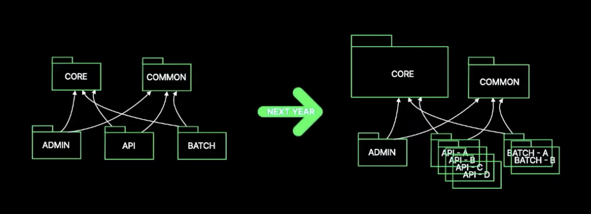
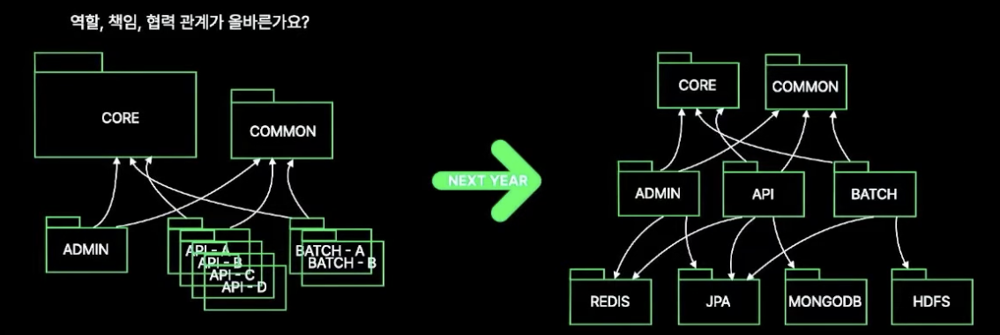
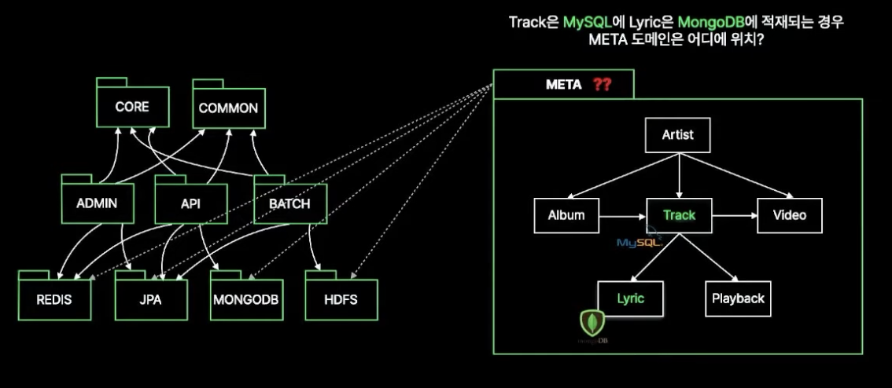
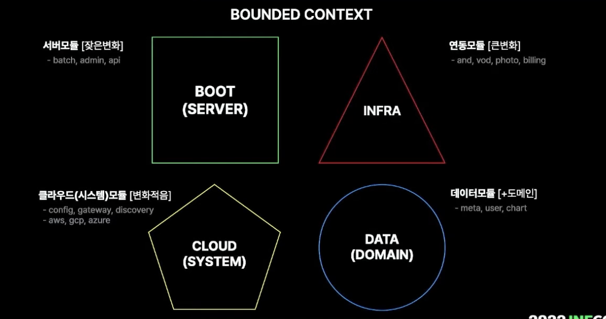
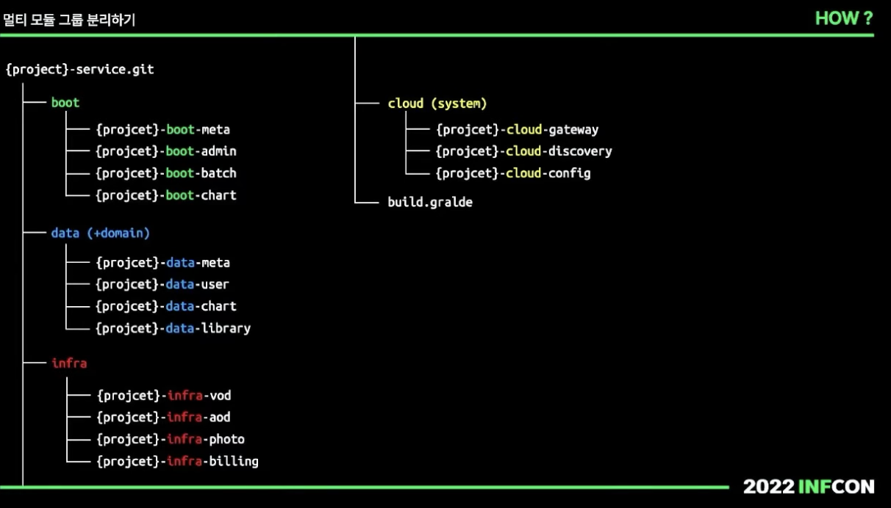
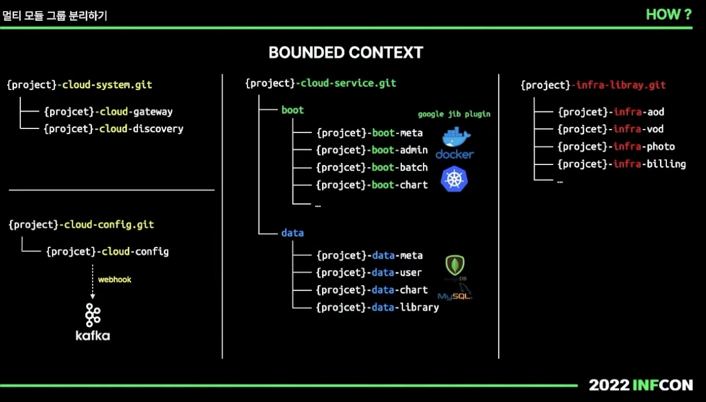
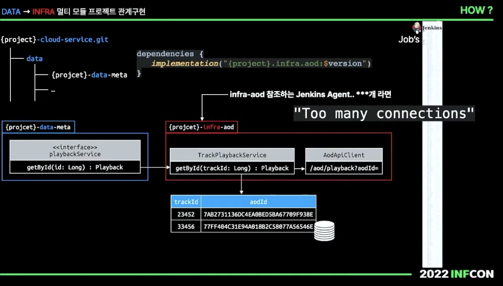
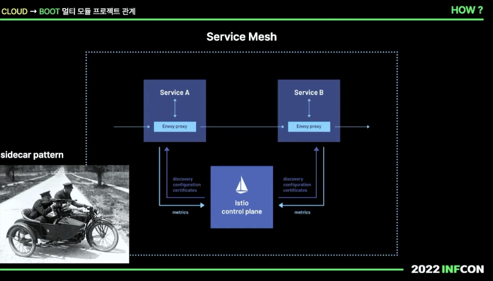

## 실전! 멀티 모듈 프로젝트 구조와 설계

1. 멀티 모듈 프로젝트 구조가 왜 중요할까?
2. 무엇을 기준으로 멀티 모듈 프로젝트를 구조로 나눠야할까?
3. 어떻게 실전 멀티 모듈 프로젝트를 구현해야할까?

### 멀티 모듈 프로젝트 구조가 왜 중요할까?

Core와 Common이 운영 초기에는 좋다. 하지만 한해가 지나고, 코드나 설정들이 많아진다면,
 Core와 Common이 비대칭적으로 더 커지게 된다. 

Core와 Common에는 각 Service와 Interface가 있다.
 두개가 사용하는 의존성 프로젝트는 커넥션 풀을 할당받게 된다.

java.lang.NoClassDefFoundError 특정한 모듈이 하위 버전 라이브러리를 참조하는 경우 업그레이드가 난해하다.

특정 모듈이 하이브러리 모듈을 참조할 경우 오류가 발생할 수 있다.

기존 프로젝트 A는 유저의 핸드폰번호나 기본 정보를 볼 수 있지만,
 어드민의 경우 마스킹을 해야할 경우가 있다. 

전체 빌드 배포가 되는 상황이다. 특정 클래스 배포한 후에 알게 된 사실은
글자 한자가 오타가 있었고, 내용을 수정해서 다시 배포를 하려면 모두 뿌려줘야한다.

처음에는 공통 모듈로 묶어두면 편해보인다.
코드도 덜 쓰는 것 같고, 중복도 줄어드는 것처럼 느껴진다.

그런데 시간이 지나면, 공통이라는 이름 아래에
정말 공통인 것과 특정 서비스 전용 코드가 같이 섞이게 된다.

결국 여러 서비스가 하나의 공통 모듈을 함께 바라보게 되고,
작은 수정 하나가 예상하지 못한 여러 프로젝트에 영향을 주게 된다.

### 무엇을 기준으로 멀티 모듈 프로젝트 구조를 나눠야할까요?

아까 본 사진을 보면, 역할, 책임, 협력이 올바른지를 확인해야한다.
 멀티모듈은 서비스 도메인 기반의 구조가 아니라 기술 베이스 지향 구조이다.

메타 모듈은, 또다른 메타 모듈을 필요로한다. 유관 부서 및 업체 모듈을 필요로한다.
 연동 모듈은 특정한 시기가 오면 의존성을 업그레이드 시킬때 코드가 굉장히 복잡해진다.

멀티 모듈을 무슨 기준으로 나눠야할까요?

1. 무조건 Core와 Common 삭제하고 시작한다.
- 그럼 어떻게 공통 부분을 처리해야하나요?
    - 일부 코드에서 어느정도 중복을 허용해야합니다. Core와 Common이 잠재적으로 갖고있는 문제성이 더 크다고 생각을 한다.

2. DDD에서 경계 나누기로 불리는, 바운디드 컨텍스트를 기준으로 나누면 어떨까?
- Boot 서버 그룹이다. (코드의 변화가 가장 적게 일어나는 부분)
- Data 도메인 그룹이다. (서버 모듈과 밀접한 관계가 있다. 도메인 영역으로 데이터를 직접 핸들링 한다.)
- 연동 모듈 그룹이다. (구현되면 변화는 없지만, 업그레이드시 코드의 큰 변화가 일어나는 부분이다.)
- 클라우드 모듈 (서버 관리를 위한 그룹, 컨테이너 트래픽 시스템 관련 모듈이다.)

또 하나 중요한 것은 의존성 방향이다.

웹, DB, 외부 연동 기술처럼 바깥쪽에 가까운 요소가
안쪽의 비즈니스 로직을 끌고 가기 시작하면,
테스트도 어려워지고 구조도 점점 무거워진다.

그래서 경계를 나눌 때는
누가 누구를 알아야 하는가를 계속 확인해야한다.

### 실전 멀티 모듈 프로젝트 구현을 어떻게 해야할까요?

현재 상태로 운영을 하다 보면, 문제점이 생긴다.
- 프로젝트가 늘어나면 빌드 시간도 늘어나고 개발 생산 시간을 늘린다.
    - 계속 늘어나는 모듈 > 복잡도 증가 > 늘어나는 빌드 시간 + ..

이렇게 분리를 한다면, 빌드 시간도 줄어들 뿐더러, 유지보수성이나, 경계도 명확해진다.

- 이런 문제를 해결하기 위해는 어떻게 해야할까?
    - 어쩔 수 없이, DB접근을 데이터 모듈쪽으로 옮겨서 사용해야한다.

**Boot, Data의 관계에 대해**
- 서비스 구현체를 어디에 둬야할지 고민이 들게된다.
    - 서로간의 규칙이 필요한데, servlet request 같은 의존성인 객체를 전달하지말아야한다. 쿠키나 세션도 마찬가지이다.
    - 웹 기반의 의존성이 강하게 들어가면, 테스트 코드를 할때 웹 서버 관련 라이브러리가 필요하게되고, 안쪽 의존성을 갖게되는 순간 많은 일이 일어나게 된다.

**Cloud, Boot의 관계에 대해**
- 디스커버리 제품에 버전업이 발생하면, 모든 서버 프로젝트가 의존성을 함께 갖기 때문에 모든 서버를 다시 올리는 불편함을 갖는다.
- 둘간의 경계를 더 분리해서 격리 시켜야하지 않을까 생각하게 된다.

실제로 운영 환경에서는
모듈 분리 자체보다도,
특정 의존성 업그레이드가 전체에 얼마나 영향을 주는지가 더 중요해진다.

예를 들어 클라우드, 디스커버리, 메시징, 보안 관련 라이브러리가
여러 서버에 강하게 물려 있으면
버전 하나 올리는 일도 전체 프로젝트의 리스크가 된다.

이런 이유로 시스템 레벨 모듈은
비즈니스 서비스와 조금 더 멀리 떨어뜨려 놓는 것이 유리하다.

### Summary

1. 왜 멀티 모듈 프로젝트가 중요할까요?
- 잘못 구성되면 나중에 변경하기가 고통스럽다.
- 프로젝트 초기에 이루어져야하는 일련의 설계 과정이다.
- 개발 생산성에 막대한 영향을 미친다. 코드 한줄 수정했지만, 빌드를 다시하고 의존성을 다시 넣는다면 힘들어진다.

2. 무엇을 기준으로 멀티 모듈 프로젝트 구조를 나눠야할까요?
- 경계안에서, 의미를 갖을 수 있는 그룹을 정의하는 것이 중요하다.
- 역할 책임 협력이 올바른지 확인한다.
- Boot, Infra, Data, System

3. 어떻게 실전 모듈 프로젝트를 구현해야 할까요?
- 프로젝트가 커지고 있다면 다시 경계를 나누고 그 기준으로 저장소를 분리한다.
- Infra 라이브러리에는 Data 관련 구현을 지향한다.
- 서비스 구현은 각자 역할에 맞게 구현될 수 있다.
- 시스템 레벨 구현이 실제 서비스 어플리케이션과 밀접하게 연관되지 않도록 격리하거나 전환해야한다.

영상 출처: https://www.youtube.com/watch?v=ipDzLJK-7Kc