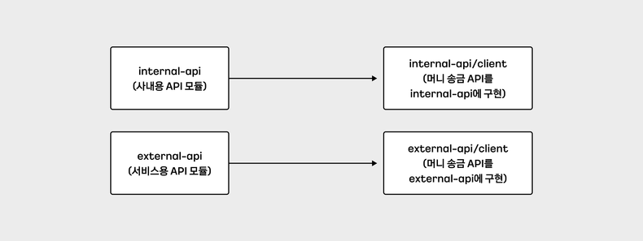
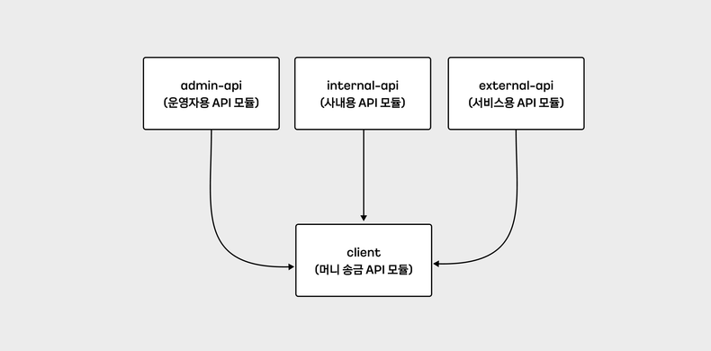
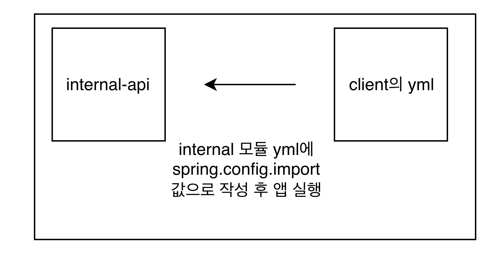

## Spring 기반 멀티모듈 프로젝트 환경변수 설정 방법

출처: https://tech.kakaopay.com/post/spring-multi-module-environment-variable/

이 글은 Spring 기반 멀티모듈 프로젝트에서 환경변수 설정하는 다양한 방법을 비교하고, 선택하는 과정을 설명합니다.

spring.config.import, spring.profiles.include, @PropertySource, @Profile을 활용한 각각의 장단점을 분석하고, 최종적으로 @Profile과 @PropertySource를 조합한 방법을 선택한 이유를 제시한다.

### 멀티모듈의 정의와 장점
멀티 모듈은 여러 개의 모듈로 구성된 프로젝트다. 각 모듈은 독립적으로 빌드되고 배포될 수 있어야한다. 이를 구성하는 이유는 코드의 재사용성을 높이고, 모듈간의 의존성을 명확히 하여 유지보수성을 향상하기 위함이다.



여기서 송금 API를 사용하는 internal-api, external-api가 있다고 가정한다. 만약 각각 송금 API인 두가지를 단일 모듈로 구성한다면, RestTemplate과 HttpClient같은 구현체를 두번이나 작성하게 될것이다. 

유지보수를 하거나, 신규 서비스 개발시에는 어떨까?, 만약 송금 API를 사용하는 admin-api(운영자용 모듈)같은 애플리케이션이 늘어난다면, 한번 더 구현체를 작성해야할 것이다. API버전이 V1에서 V2로 변경될 경우 매번 프로젝트에 반영해야한다.



이를 위해 멀티 모듈로 구성하게 된다면, 총 이렇게 네개로 구성해야할 것이다. 

다시 말해 각 API 모듈(위에 총 3개) 의 build.gradle을 통해 client 모듈을 implementation으로 의존성을 명시할 것이다.
그래서 API버전이 V1에서 V2로 변경되는 작업의 경우 client만 업그레이드 해주면 모두 다 업그레이드가 된다.

> 공통으로 의존성을 빼서 업그레이드를 시킨다는 말인것 같다.

### 멀티 모듈에서의 환경변수에 대한 고민
위에서 말한 것 처럼 API 스펙이 V1에서 V2로 단순하게 path만 변경됐다고 가정한다. API path같은 경우, 코드로 선언하여 넣을 수도 있지만, 팀마다 환경변수 관리법이 다르다. 작성자분은, host나 path같은 정보는 yml또는 properties와 같은 환경 변수로 파일로 관리하고 있다. 이러면 환경변수 파일은 어디에 둬야할까?, api모듈?, client? 어디에 있어야할까? 

API 스펙과 가장 관련있는 것을 보려면, 그것은 Client일 것이다. 그렇다면 client 모듈 내 환경변수 파일을 만들어야할 것 같은데, 파일의 이름은 어떻게 지으면 좋을까? 더 나아가서, Spring 애플리케이션에서 활성화된 프로필마다 host가 달라져야하는 경우라면?

그 고민은 밑에 소개한다.

### 예시 프로젝트 환경 구성
이해를 위해 빠르게 설명한다. 

예시의 프로젝트는 internal-api, client라는 모듈 두가지가 있다.
internal모듈은 build.gradle을 통해 client모듈을 implementation으로 의존성을 명시하고 있다. 만약 client 모듈이 재사용성이 없다면, 구현 내용을 internal-api 모듈 내 구현하지만, 다른 모듈에서도 재사용될 것을 생각하여, client 모듈은 별도 구현했다. 

client모듈에서 필요한 환경 변수는 host, transfer-money-path 같은 송금 API 요청을 하기위한 변수이다.

깃 레포지토리: https://github.com/parkgeonhu/spring-multi-module-environment-variable

### 1. spring.config.impor를 이용하여 환경변수 설정
첫번째로 살펴볼 방법이다. 먼저 application.yml에 spring.config.import를 추가한다. 그리고 아래 추가하고싶은 모듈의 yml을 명시해주면 된다. 

앞서 말한것 처럼 internal모듈에서 client모듈을 가져다가 사용한다. 그래서 client 모듈의 yml파일을 Internal모듈 내 application.yml에 spring.config.import 값으로 작성하고 애플리케이션을 실행해야한다.



이렇게 인거같다. 

```java
internal-api 모듈 안에 application.yml이다.

spring:
  config:
    import:
      - 'classpath:spring-config-import.yml'
```

```java
client 모듈내의 spring-config-import.yml이다.

spring-config-import:
  properties:
    host: https://partner.kakaopay.com
    transfer-money-path: /v1/transfer/money/by-spring-config-import
```

```java
client 모듈내의 EnvFromSpringConfigImport.kt

@Configuration
@ConfigurationProperties(prefix = "spring-config-import")
class EnvFromSpringConfigImport {
   lateinit var properties: Map<String, String>
}
```

```java
client 모듈내의 TransferClient.kt

@Component
class TransferClient(
   private val envFromSpringConfigImport: EnvFromSpringConfigImport
) {
   @PostConstruct
   fun postConstruct() {
      println("TransferClient initialized")
      println("envFromSpringConfigImport: ${envFromSpringConfigImport.properties}")
   }
}
```

위와같이 파일을 작성하고 돌려보자, TransferClient가 bean으로 생성되고, 의존성 주입이 완료됐을 때, @PostConstruct가 붙어있는 메서드가 실행된다. 

이렇게 했을 경우, 환경변수가 잘 주입이 된다는것을 확인할 수 있다. 다만, 매번 import로 명시를 해주어야하는 과정이 번거롭게 느껴질 수 있다.

예를 들어, 메시지 전송 클라이언트가 추가되고, 메시지 전송 yml을 만든다고 가정하자, 이 메시지를 사용하는 애플리케이션의 yml마다 spring.config.import값으로 메시지 전송 클라이언트 yml을 명시해야한다.

이러한 사항들로 인해, yml도 늘어나고, 의도치않게 추가하다가 누락되는 경우가 생길 수 있다. 또는 Import해야하는데 깜빡한다면, 운영 서비스에 영향을 끼칠 수 있다.

### 2. spring.profiles.include 이용하여 환경변수 설정
Spring 애플리케이션을 실행할때, 활성화 또는 포함되는 프로필에 따라 yml을 불러온다.

예를들어 어떤 모듈의 환경변수 파일을 application-sandbox.yml이라고 한다면, 해당 모듈을 참조하고 있는 애플리케이션의 프로필에 샌드박스가 포함되어있어야한다.

```java
internal-api 모듈내의 resources/application.yml

spring:
  profiles:
    include: spring-profiles-include
```
```java
client 모듈내의 application-spring-profiles-include.yml

spring-profiles-include:
  properties:
    host: https://partner.kakaopay.com
    transfer-money-path: /v1/transfer/money/by-spring-profiles-include
```
```java
client 모듈내의 EnvFromSpringProfilesInclude.kt

@Configuration
@ConfigurationProperties(prefix = "spring-profiles-include")
class EnvFromSpringProfilesInclude {
   lateinit var properties: Map<String, String>
}
```
```java
client 모듈내의 TransferClient.kt

@Component
class TransferClient(
   private val envFromSpringProfilesInclude: EnvFromSpringProfilesInclude
) {
   @PostConstruct
   fun postConstruct() {
      println("TransferClient initialized")
      println("envFromSpringProfilesInclude: ${envFromSpringProfilesInclude.properties}")
   }
}
```

이렇게 각 모듈에 파일을 작성하고 실행하면 TransferClient가 bean 생성되고, 의존성 주입이 완료되었을때, @PostConstruct 붙어있는 메서드가 실행된다.

1. internal에서 기본으로 yml을 읽어 오고 spring-profiles-include라는 프로필이 포함된다.

2. internal은 client모듈을 참조하고 있다.

3. spring-profiles-include라는 프로필이 포함되어있어, 그에 맞는 환경변수 설정을 읽어온다.

이렇게 환경변수를 역할에 맞게 설정할 수 있지만, 이 역시 명시해주어야한다. naming convention에 따라 {프로필이름}.yml 처럼 적어야한다는 사항을 숙지해놔야만한다.

### 3. PropertySource를 이용하여 환경변수
이번엔 @PropertySource 어노테이션은 value에 명시한 properties파일의 내용이 환경변수로 등록되도록 도와주는 어노테이션이다.

예를 들어, me.team=partnerplatform 작성한 properties를 만들고 이 파일을 value명시를 해주면, 애플리케이션의 Me.team에 대한 환경변수 값은 partnerplatform이 된다.

```java
client 모듈내의 property-souce-default.properties

property-source.properties.host=https://default-partner.kakaopay.com
property-source.properties.transfer-money-path=/v1/transfer/money/by-property-source
```

```java
client모듈내의 EnvFromPropertySource.kt

@Configuration
@ConfigurationProperties(prefix = "property-source")
class EnvFromPropertySource {
   lateinit var properties: Map<String, String>
}
```

```java
client모듈내의 ProfileConfig.kt
class ProfileConfig {
   @Configuration
   @PropertySource("classpath:/transfer-client/property-source-default.properties") // 불러오고 싶은 properties 파일의 path
   class DefaultConfig
}
```

```java
client모듈내의 TransferClient.kt

@Component
class TransferClient(
   private val envFromPropertySource: EnvFromPropertySource
) {
   @PostConstruct
   fun postConstruct() {
      println("TransferClient initialized")
      println("envFromPropertySource: ${envFromPropertySource.properties}")
   }
}
```

이렇게 하면 폴더에 위치하고 있는 각 키에대한 Value값을 잘 가져오는것을 확인할 수 있다. 

### 4. Profile과 @PropertySource를 이용하여 환경변수 설정

이 챕터에서는 실제 운영하는 환경에서의 상황을 하나 더 추가한다. 여기서 개발자환경 Dev, sandbox, beta , prod환경이 있다. 

여기서 각각 호출해야하는 api의 host가 다르다. 각 환경마다 환경변수를 설정해줘야한다. 이 팀의 경우 샌드반스 환경에서 Spring을 실행시킬 때, ~~ active=sandbox를 옵션줘야한다. 

이러한 배경에서 각 프로필마다 다르게 설정되어야한다는 요구사항을 추가하겠다. 추가 요구사항은 환경 운영환경등 각 host가 달라야한다.

```java
client 모듈내의 properties

property-source.properties.host=https://default-partner.kakaopay.com
property-source.properties.transfer-money-path=/v1/transfer/money/by-property-source
```

```java
client 모듈내의 sandbox.properties

property-source.properties.host=https://sandbox-partner.kakaopay.com
property-source.properties.transfer-money-path=/v1/transfer/money/by-property-source
```
```java
client, prod.properties

property-source.properties.host=https://production-partner.kakaopay.com
property-source.properties.transfer-money-path=/v1/transfer/money/by-property-source
```
```java
client 모듈내의 EnvFromPropertySource.kt

@Configuration
@ConfigurationProperties(prefix = "property-source")
class EnvFromPropertySource {
   lateinit var properties: Map<String, String>
}
```
```java
client 모듈내의 ProfileConfig.kt

class ProfileConfig {
   @Configuration
   @Profile("sandbox")
   @PropertySource("classpath:/transfer-client/property-source-sandbox.properties")
   class SandboxConfig

   @Configuration
   @Profile("production")
   @PropertySource("classpath:/transfer-client/property-source-production.properties")
   class ProductionConfig

   @Configuration
   @Profile("!sandbox && !production")
   @PropertySource("classpath:/transfer-client/property-source-default.properties")
   class DefaultConfig
}
```

```java
client 모듈내의 TransferClient.kt

@Component
class TransferClient(
   private val envFromPropertySource: EnvFromPropertySource
) {
   @PostConstruct
   fun postConstruct() {
      println("TransferClient initialized")
      println("envFromPropertySource: ${envFromPropertySource.properties}")
   }
}
```
이렇게 작성시 

```java
# 어떠한 프로필도 설정하지 않고 실행 시
TransferClient initialized
envFromPropertySource: {host=https://default-partner.kakaopay.com, transfer-money-path=/v1/transfer/money/by-property-source}

# 샌드박스(sandbox) 프로필로 실행 시 (-Dspring.profiles.active=sandbox)
TransferClient initialized
envFromPropertySource: {host=https://sandbox-partner.kakaopay.com, transfer-money-path=/v1/transfer/money/by-property-source}

# 운영(production) 프로필로 실행 시 (-Dspring.profiles.active=production)
TransferClient initialized
envFromPropertySource: {host=https://production-partner.kakaopay.com, transfer-money-path=/v1/transfer/money/by-property-source}
```

결과를 보면, 각각 불러오는 값이 다르다는것을 알 수 있다. @Profile 어노는 특정 프로필이 활성화 또는 포함시 bean등록을 조건부로 허용하는 어노테이션이다. @PropertySource를 통해 불러오는 환경변수 파일이 달라지고, 프로필에 따라 불러오는 환경변수가 달라진다. 

예를들어, sandbox프로필 활성화시 , sanboxConfig가 빈으로 등록되고, 다른것도 마찬가지로 등록된다. 프로필마다 달라지는 빈을 명시적으로 선언하면, 이름 규칙이나 제한 없이 생성할 수 있게 된다. 

### 외의

애플리케이션 컨텍스트 리프레시가 시작되기 전에 읽어야 하는 logging.이나 spring.main. 같은 프로퍼티는 @PropertySource로 설정하기에 적합하지 않다.

1. 애플리케이션 시작 및 Environment 준비
application.yml, application.properties 등 파일 로딩
2. 애플리케이션 컨텍스트(Application Context) 리프레시 시작
@Configuration 클래스 파싱 중 @PropertySource를 통한 프로퍼티 로딩
3. 애플리케이션 컨텍스트 리프레시 완료 및 Bean 생성 완료

이기 때문이다. PropertySource로 추가된 값의 적용 시점은 , 애플리케이션 컨텍스트 리프레시 과정중 Environment에 등록되는 시점이다. 이 팀 역시 초기에 필요한 프로퍼티는 application.yml에 명시하여 사용하고 있다. 

이외의 로딩이 되어도 문제가 없는것은 @PropertySource를 활용한다. 